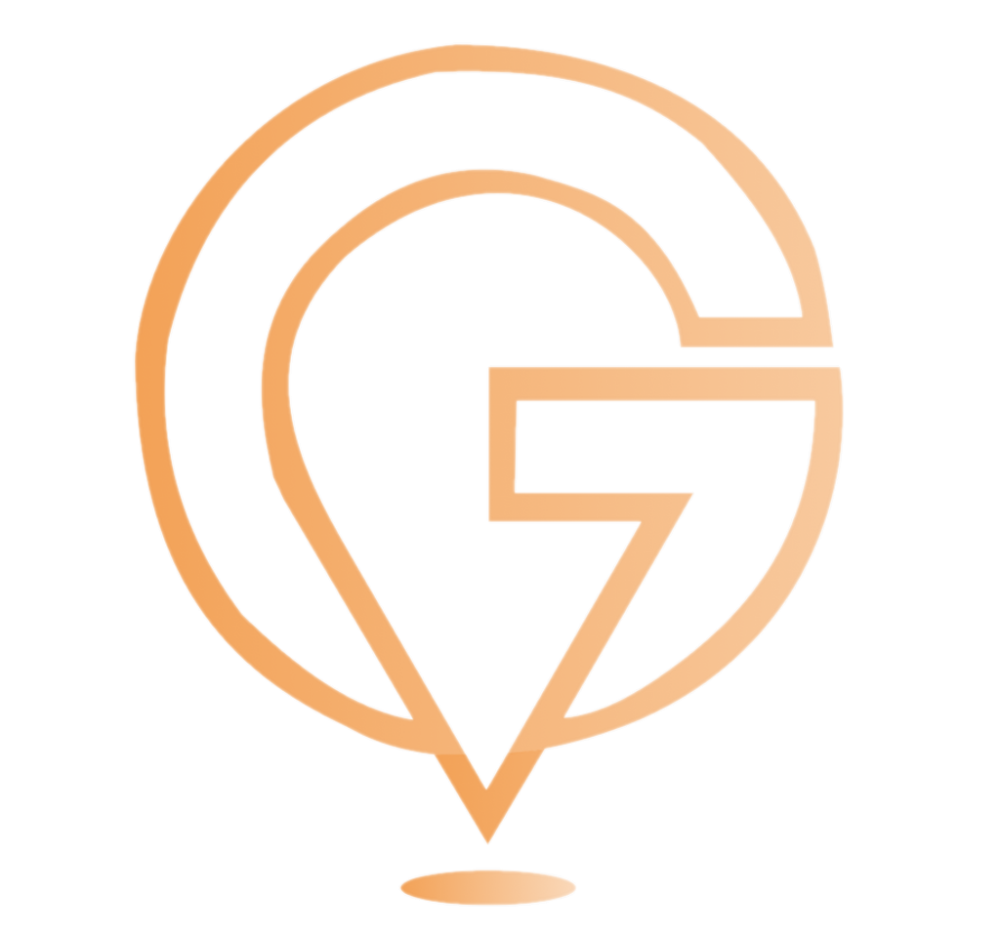

<h1 align="center"> C23-PS041-Get ReToRe   (Budget Recommendation for Tourist & Recreation) </h1>

Halo lur👋 We're a team consist of 6 peoples from Indonesia in a programs called Bangkit Academy, founded and arranged by Google, Traveloka, Goto and Dicoding. We're creating a Product-based Capstone Project with selected theme of Tourism, Cultural, and Hospitality. The aim of this Capstone Project is to develop a travel recommendation system based on budget constraints using machine learning techniques that integrate with cloud computing services and can be accessed easily through android mobile apps.

   
More Information

## Our Teams
Our team consist of 3 distinct division, with each with its own set of responsibilities. The Machine Learning Division focuses on creating algorithms to enhance the optimization and presentation of travel recommendations. The Mobile Development Division focuses on designing an application interface where the user can interact. Finally, the Cloud Computing Division is responsible for developing an API that facilitates data transfer and connects the Machine Learning Division to the Mobile Development Division

### Machine Learning Division
| Bangkit ID | Name | Social Media |
|:----------:|:----:|--------------|
|M340DSX0121|Muhammad Fikrussyifa Kemal Fasya|[LinkedIn](https://www.linkedin.com/in/fkrssyf)  [Github](https://github.com/fkrssyf) |
|M340DSX3643|Aldin Wildan Razaqa|[LinkedIn](https://www.linkedin.com/)  [Github](https://github.com/) |
|M185DKX4196|Helmy Fachreza Himawan|[LinkedIn](https://www.linkedin.com/)  [Github](https://github.com/) |

 ### Cloud Computing Division
| Bangkit ID | Name | Social Media |
|:----------:|:----:|--------------|
|C169DSX0926|Adam Yogisyah Putra|[LinkedIn](https://www.linkedin.com/)  [Github](https://github.com/)  |
|C185DKX4225|Muhammad Tatmainnul Quluub|[LinkedIn](https://www.linkedin.com/in/muhammad-tatma-542120200/)  [Github](https://github.com/MuhammadTatma)  |

### Mobile Development Division
| Bangkit ID | Name | Social Media |
|:----------:|:----:|--------------|
|A185DSX3048|Muhammad Risto Abrar|[LinkedIn](https://www.linkedin.com/in/muhammad-risto-649536210/)  [Github](https://github.com/) |

## Repository
  
### Machine Learning
1. [Repo-ML](https://github.com/Get-ReToRe/ML-Repo).

### Cloud Computing
1. [Get ReToRe-API](https://github.com/Get-ReToRe/Get-ReToRe-API).

### Mobile Development
1. [Repo-MD](https://github.com/Get-ReToRe/MD-Repo).
  

 We are IT Solutions Enablers!   C23-PS041 Teams. 

